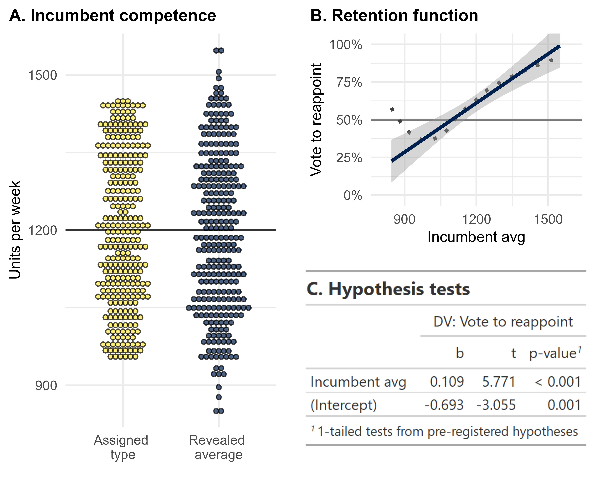
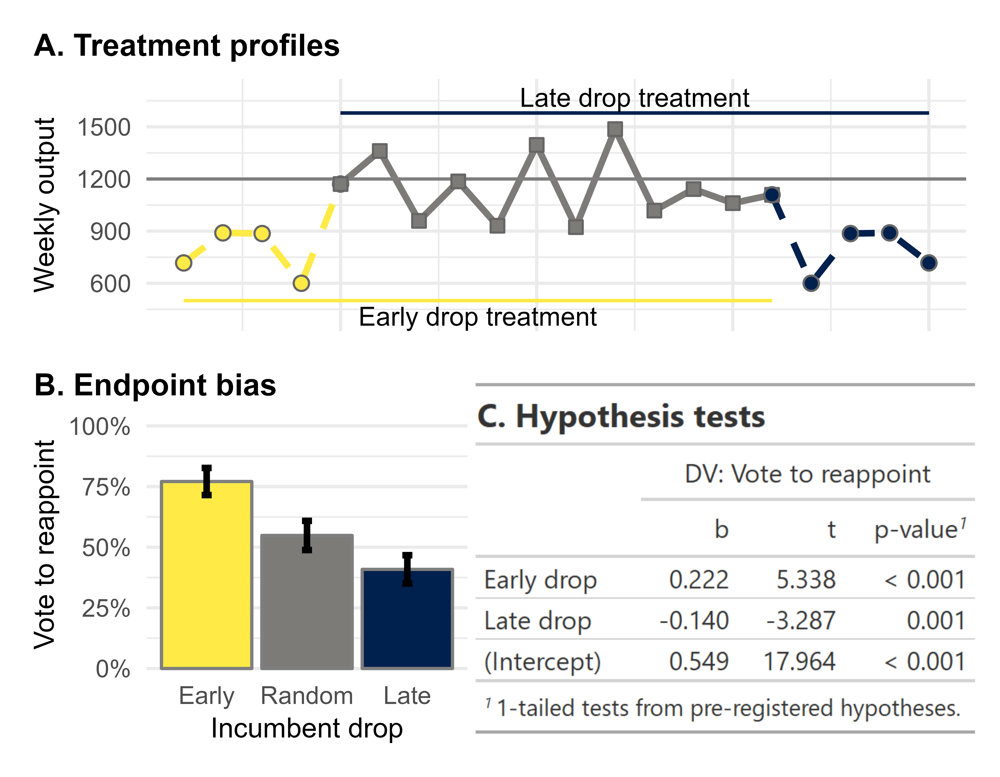
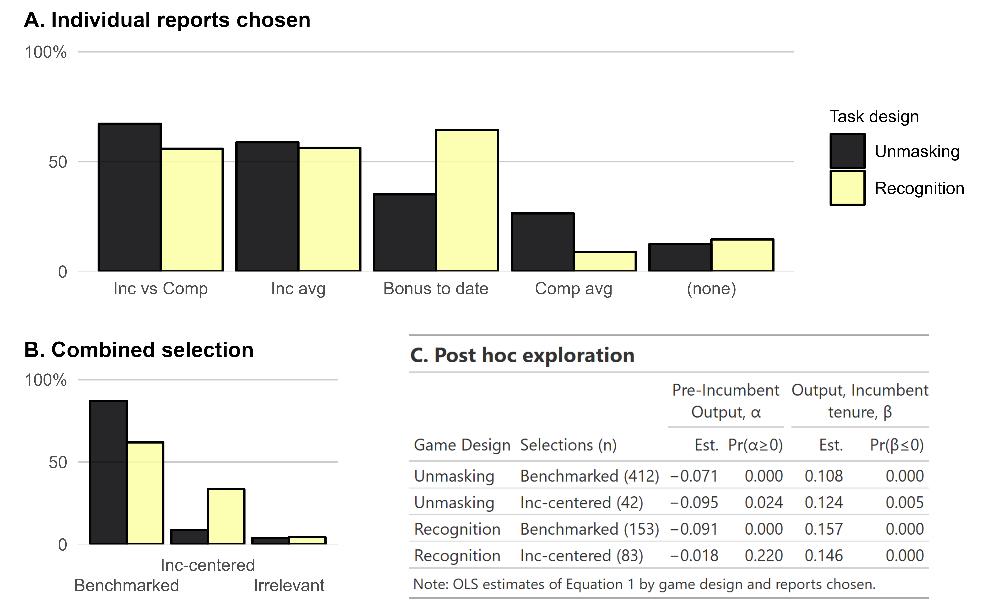

```{r setup, include=FALSE}
  options(htmltools.dir.version = FALSE)
  knitr::opts_chunk$set(
    message=F, warning=F, eval=T, echo=F, 
    fig.align='center', dev='svglite', dpi = 400
  )
  
  library(tidyverse)
  library(patchwork)
  library(knitr)
```

# Retrospective voting

.left-column[

### Foundational

### Ubiquitous-ish

### Causal

### Meaningless?
]

.right-column[
```{r rvplot, out.width="650px"}
knitr::include_graphics('figures/rvplot.svg')
```
]


---
# Unexplored microfoundations

> Do voters' judgments sensibly differentiate competent from incompetent incumbents?  

&nbsp;

### Central task of retrospective voting requires
- **Integration** over stream of performance info
- **Appraisal** of impression
  
### I/A largely unseen
- Observational limitations
- Experimental short-circuit


---
# Short-circuiting I/A in experiments

&nbsp;
<blockquote>
Experts say that not only have economic conditions deteriorated a lot over the last year, but the British economy is doing considerably worse that most other countries.
.right[-- Tilly & Hobolt, 2011]
</blockquote>

- Vignette provides 
  - pre\-integrated summary ("deteriorated a lot")
  - appraisal cue ("considerably worse")
- Have yet to study I/A in controlled setting


---
# Contributions of the book

&nbsp;

.pull-left[
### Integration/Appraisal framework
- Theoretical and empirical lens for studying retrospective voting
- 11 experiments allowing I/A to unfold
  - Competency/biases
  - Confronting problem of spillover
  - How voters seek out and use performance cues in I/A problems
]

.pull-right[
### Case for 'synthetic' experiments
- Rethinking realism and external validity
- Impact\-estimating vs Theory\-testing
- Criteria for external validity of synthetic experiments for testing theory
]


---
# Experimental framework

.pull-left-1[
- Overview: incentivized game 
  - Supervise a new factory worker 
  - Monitor for 16 weeks
  - Elect to reappoint/replace  

- Possible manipulations
  - Parameters of performance
  - Num of workers
  - Info environment

- N = 7,309 U.S. adults 

]

.pull-right2[
&nbsp; 
.center[]
]

---
class: segue-yellow

# Competencies and biases in I/A


---
# Exp 1. Baseline performance vote

> Given variable stream of performance, can voters identify competent incumbents? 

.pull-left-1[
- N = 248

- Key design elements
  - Competence $\mu_w \sim U(950,1450)$
  - Output $Y_{wt} \sim N(\mu_w,250^2)$

- Findings
  - Subjects manage I/A
  - Demonstrate rules comp
  - Not 'blindly retro'
]

.pull-right-2[

```{r fig3, out.width = '550px'}
  
```
]

---
# Exp 4. Recency bias

> Do participants place more weight on performance late in an incumbent's term? 

.pull-left-1[
- N = 764

- Key design elements
  - Fixed type & output
  - Randomize "downturn"
  
- Findings
  - Recency bias in I/A
  - Not 'highly sophisticated'
]

.pull-right-2[

```{r fig6, out.width = '550px'}
  
```
]


---
class: segue-yellow

# Confronting spillover in I/A

---
# Multiworker designs

.pull-left-1[
### Game Flow
1. Comparator begins
2. Monitor factory output, $F_{pre}$
3. Incumbent arrives in week 8
4. Monitor factory output, $F_{post}$
5. Vote on reappointment
]

.pull-right-2[

### Unmasking Design: Extract competece?
- $F_{pre} = C_{pre}$
- Incumbent works alongside Comparator
- $F_{post} = C_{post} + I_{post}$ 

### Recognition Design: Ignore spillover?
- $F_{pre} = C_{pre}$
- Comparator quits; Incumbent replaces 
- $F_{post} = I_{post}$ 
]


---
# I/A strategies in context of spillover

&nbsp;

### Estimating response, multiworker games

Model reappointment as function of output in each stage

$$Reappoint_i = \alpha F_{pre,i} + \beta F_{post,i} + \theta + u_i$$

### Predictions from conventional theories

| Strategy       | Pre-Inc, $F_{pre}$  | Inc tenure, $F_{post}$   |
|:---------------|---------------------|--------------------------|
| Blind retrospection  | $\alpha > 0$ | $\beta>0$      |
| Rational discounting | $\alpha = 0$ | $\beta>0$, $\beta=f(\kappa)$  |
| Benchmark comparison | $\alpha < 0$ | $\beta>0$ |


---
# Consistent benchmark response

&nbsp;

$$Reappoint_i = \alpha F_{pre,i} + \beta F_{post,i} + \theta + u_i$$


### Estimates of I/A under interdependence

| Study |	Design (n)  | $\hat{\alpha}$ | $Pr(\alpha \geq 0)$  | $\hat{\beta}$ | $Pr(\beta \leq 0)$ |
|-------|:------------|----------|--------|---------|---------|
| 5	| Unmasking (819) |	-0.093 |	< 0.001 |	0.135	| < 0.001 |
| 6	| Recognition (368) |	-0.055 |	< 0.001 |	0.123	| < 0.001 |
| 7	| Unmasking (550) |	-0.114 |	< 0.001	| 0.158	| < 0.001 |
| 8	| Unmasking arm (173) |	-0.129 |	< 0.001 |	0.151	| < 0.001 |
|	  | Recognition arm (217) |	-0.065 |	< 0.001 |	0.153	| < 0.001 |
| 9	| Unmasking arm (894)	| -0.138 |	< 0.001	| 0.192	| < 0.001 |
| 	| Recognition arm (182) |	-0.047 |	< 0.001 |	0.156	| < 0.001 |
| 11 |	Dual stream (918) |	-0.182 |	< 0.001	| 0.131	| < 0.001 |


---
# Exp 8. Seeking performance cues

> Given choice among summary measures of performance, do participants actively seek pre-benchmarked information? 

.pull-left-1[
- N = 720

- Key design elements
  - Two\-worker stream
  - Randomize game type
  - Offer choice of two reports
  
- Findings
  - Benchmark seeking
  - Esp in difficult task
]

.pull-right-2[
.center[]
]

---
# Overview of experimental results

- I/A over variable streams
  - Capable judges of competence
  - Clear strategy to confront spillover

- Clear limitations
  - Sub-optimal decisions
  - Recency bias; maybe some negativity bias

- So much benchmarking
  - Quick to I/A by comparison
  - Evidence of benchmark-seeking
  - Benchmarking as baseline strategy


---
class: segue-yellow

# External validity and experimental design


---
# Synthetic experiments and generalization

&nbsp;

> If we want to learn about political behavior, shouldn't our design be more *realistic*?

&nbsp;

.center[.large[No.]]

&nbsp;

- Our goal is theory-testing
- The target of generalization is abstract
- Design should follow epistemic aim


---
# Rethinking parallelism and epistemic aim

<blockquote>
Whereas [randomized evaluations] generally have high mundane
realism, some—but not all!—laboratory and survey experiments do not and thus provide a poor basis for external validity inferences
.right[-- Findley et al. (2021)]
</blockquote>

.pull-left[
### Impact-estimating
- 'How much...?'
- Target: specific, contextual
- Realistic design to match site

]

.pull-right[
### Theory-testing
- 'How does...?'
- Target: general, acontextual
- Abstract designs to match theory
]

---
# Specific criteria for abstract designs

&nbsp;

Evaluating 'synthetic' designs for testing theory
- Identify theory testing as central goal
- Ground efforts at generalization in theory
- Specify models or a priori propositions under study  

&nbsp;

- Env captures only essential essence of the models
- Creates space for target behaviors to emerge
- Balances experimental realism with integrity of abstract env


---
class: sydney-red

# *Quality Control* and next steps

- Voters and the integration-appraisal task
  - Not so sophisticated. Not kicking dogs.
  - Reasonably effective, strategic 

- Of theories and voters

- Next steps  
  - Appraise first, integrate late?
  - Role of appraisal cues in I/A
