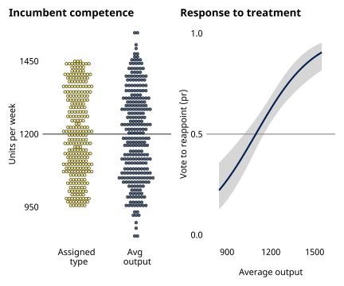
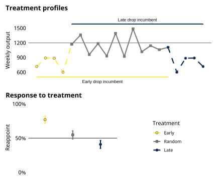
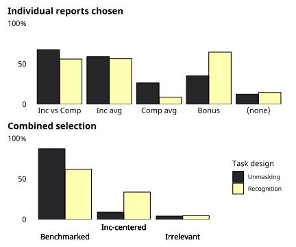

```{r setup, include=FALSE}
  options(htmltools.dir.version = FALSE)
  knitr::opts_chunk$set(
    message=F, warning=F, eval=T, echo=F, 
    fig.align='center', dev='svglite', dpi = 400
  )
  
  library(tidyverse)
  library(patchwork)
  library(knitr)
```

# Retrospective voting

.left-column[

### Foundational

### Ubiquitous-ish

### Causal

### Meaningless?
]

.right-column[
.center[]
]


---
# Unexplored microfoundations

### Can subjects differentiate competent from incompetent incumbents?  


- Retrospective voting *requires*
  - **Integration** over stream of performance info
  - **Appraisal** of impression
  
- But I/A largely unseen
  - Uncommon focus of theory
  - Obs & Exp limitations


---
# Past experiments short-circuit I/A

&nbsp;
<blockquote>
Experts say that not only have economic conditions deteriorated a lot over the last year, but the British economy is doing considerably worse that most other countries.
.right[-- Tilly & Hobolt, 2011]
</blockquote>

- Vignette provides 
  - pre\-integrated summary
  - explicit appraisal cue  
  
- Have yet to study I/A in controlled setting


---
# Contributions of the book
  
  
.pull-left[
### Integration/Appraisal framework
- Theoretical & empirical lens for studying retrospective voting
- 11 experiments allowing I/A to unfold
  - Competency/biases
  - Confronting spillover
  - Seeking and using performance cues 
]

.pull-right[
### Case for 'synthetic' experiments
- Rethinking realism and external validity
- Impact\-estimating vs Theory\-testing
- Criteria for external validity for experiments that test theory
]


---
class: segue-yellow

# Capacity and bias in I/A


---
# Experimental framework

.pull-left-1[
- Supervise new worker 
  - Fully\-trained 
  - Type unknown, <br> $\mu_{inc} \sim U(950,1450)$
  - Output variable, <br> $Y_{inc,t} \sim N(\mu_{inc},250^2)$  
  
- Monitor for 16 'weeks'
- Vote to reappoint/replace 'Incumbent'
- Bonus $\propto$ factory output

]

.pull-right2[
&nbsp; 
.center[]
]

---
# Exp 1. Baseline performance vote

### Given variable stream, can subjects identify competence? 

.pull-left-1[
- N = 248

- Key design elements
  - $\mu_{inc} \sim U(950,1450)$
  - Output $Y_{inc,t} \sim N(\mu_{inc},250^2)$

- Findings
  - Subjects manage I/A
  - Demonstrate rules comp
  - Not 'blindly retro'
]

.pull-right-2[

```{r fig3, out.width = '550px'}
  
```
]

---
# Exp 4. Recency bias

### Do participants overemphasize recent/late-term performance? 

.pull-left-1[
- N = 764

- Key design elements
  - Fixed type/output
  - Randomize timing of "drop"
  
- Findings
  - Recency bias in I/A
  - Not 'highly sophisticated'
]

.pull-right-2[

```{r fig6, out.width = '550px'}
  
```
]


---
class: segue-yellow

# Confronting spillover in I/A


---
# Strategies for managing spillover

### How--and how well--do voters differentiate competence from luck? 

- Blind retrospection (Achen & Bartels 2016)  
  - No accounting for spillover
  - RV as myopic, indiscriminant displacement

- Rational discounting (Duch & Stevenson 2008) 
  - Voters discount by variance of spillover
  - RV as sophisticated signal extraction
  
- Benchmark comparison (Kayser & Peress 2012)  
  - Competence in relative performance gap
  - RV as low-info "social comparison" 


---
# Multiworker designs

.pull-left-1[
### Game Flow
1. Comparator begins
2. Monitor factory output, $F_{pre}$
3. Incumbent arrives in week 9
4. Monitor factory output, $F_{post}$
5. Vote on reappointment
]

.pull-right-2[
```{r multiflow, out.width = '550px'}
  knitr::include_graphics('figures/multidesign.svg')
```
]


---
# Estimation and predictions


&nbsp;

$$Reappoint_i = \alpha F_{pre,i} + \beta F_{post,i} + \theta + u_i$$

### Model predictions

| Strategy       | Pre-Inc, $F_{pre}$  | Inc tenure, $F_{post}$   |
|:---------------|---------------------|--------------------------|
| Blind retrospection  | $\alpha > 0$ | $\beta>0$      |
| Rational discounting | $\alpha = 0$ | $\beta>0$, $\beta=f(\kappa)$  |
| Benchmark comparison | $\alpha < 0$ | $\beta>0$ |


---
# Exp 5. Unmasking competence

### Can subjects extract competencce from confounded stream? How?

.pull-left-1[
- N = 849  

- Key design elements
  - Randomize type\output
  - Variance treatment $\sigma_{comp} \in (100,250)$
  
- Findings
  - Capable signal extraction
  - Benchmark processing
]

.pull-right-2[
```{r study5, out.width = '550px'}
  knitr::include_graphics('figures/study5sum.svg')
```
]

---
# Consistent benchmark response

&nbsp;

$$logit(Reappoint_i = 1) = \alpha F_{pre,i} + \beta F_{post,i} + \theta + u_i$$


### Estimates of I/A under interdependence

| Study |	Design (n)  | $\hat{\alpha}$ | $Pr(\alpha \geq 0)$  | $\hat{\beta}$ | $Pr(\beta \leq 0)$ |
|-------|:------------|----------|--------|---------|---------|
| 5	| Unmasking (849)       |	-0.59 |	< 0.001 |	0.86	| < 0.001 |
| 6	| Recognition (368)     |	-1.12 |	< 0.001 |	1.56	| < 0.001 |
| 7	| Unmasking (550)       |	-0.62 |	< 0.001	| 0.87	| < 0.001 |
| 8	| Unmasking arm (473)   |	-0.49 |	< 0.001 |	0.68	| < 0.001 |
|	  | Recognition arm (247) |	-0.47 |	< 0.001 |	1.03	| < 0.001 |
| 9	| Unmasking arm (894)	  | -0.26 |	< 0.001	| 0.54	| < 0.001 |
| 	| Recognition arm (482) |	-0.28 |	< 0.001 |	0.90	| < 0.001 |
| 11 |	Dual stream (920)   |	-0.80 |	< 0.001	| 0.57	| < 0.001 |


---
# Exp 8. Seeking performance cues

### Do participants actively seek pre-benchmarked information? 

.pull-left-1[
- N = 720

- Key design elements
  - Two\-worker stream
  - Randomize game type
  - Offer choice of two reports
  
- Findings
  - Benchmark seeking
  - Esp in difficult task
]

.pull-right-2[
```{r fig8, out.width = '550px'}
  
```
]

---
# Overview of experimental results

- I/A over variable streams
  - Capable judges of competence
  - Clear strategy to confront spillover

- Clear limitations
  - Sub-optimal decisions
  - Recency bias; maybe some negativity bias

- Strategic, if sub-optimal, behavior
  - Quick to benchmark
  - Quick to seek out benchmarks


---
class: segue-yellow

# External validity and experimental design


---
# Synthetic experiments and generalization

&nbsp;

> If we want to learn about political behavior, shouldn't our design be more *realistic*?

&nbsp;

.center[.large[No.]]


---
# Rethinking realism and generalization

&nbsp;
<blockquote>
Whereas [randomized evaluations] generally have high mundane
realism, some—but not all!—laboratory and survey experiments do not and thus provide a poor basis for external validity inferences
.right[-- Findley et al. (2021)]
</blockquote>


- Realism/parallelism of experiment...
  - cannot establish external validity
  - may limit, rather than strictly enhance, external validity
  
- Study should mimic the target of generalization

---
# Intent and design

&nbsp;

|                       | Impact-estimating | Theory-testing    |
|:----------------------|:------------------|:------------------|
| Generalize to what?   | Impact/ATE        | Model             |
| Nature of target      | Complex           | "Universal"       |
|                       | Context-bound     |                   |
| Design to match       | Realistic         | Synthetic         | 
|                       | Specific          | Abstract          |
| Limitations           | Local             | Thin              |


---
# Criteria for external validity

### in 'synthetic' experiments for testing theory

- Setup
  - Identify theory testing as central goal
  - Ground generalization in theory
  - Specify models & *a priori* propositions under study  

- Design
  - Exp "world" captures only essential essence of the models
  - Creates space for contested behaviors to emerge
  - Experimental realism


---
class: sydney-red

# *Quality Control* and next steps

- Integration-appraisal framework
  - I/A *necessary* for RV
  - Should be focus of theory
  - Allowed to unfold in controlled settings
  
- Findings from 11 experimental tests
  - Capacity beyond blind retrospection
  - Sophistication below rational discounting
  - Strategic, imperfect benchmarking 

- Next steps  
  - Appraise first, integrate later
  - Role of appraisal cues in I/A
